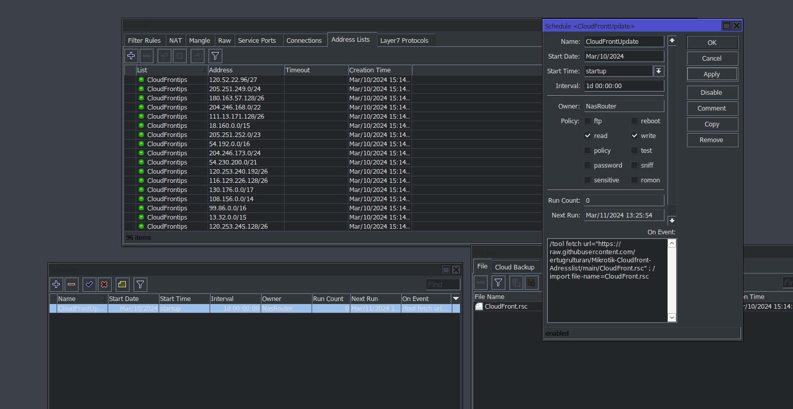

[](https://github.com/ertugrulturan/Mikrotik-Cloudfront-Adresslist/actions/workflows/main.yml)
Use (You can add it as a Scheduler),
```
/tool fetch url="https://raw.githubusercontent.com/ertugrulturan/Mikrotik-Cloudfront-Adresslist/main/CloudFront.rsc" ; /import file-name=CloudFront.rsc
```


Tested by RouterOS 7.13.5
